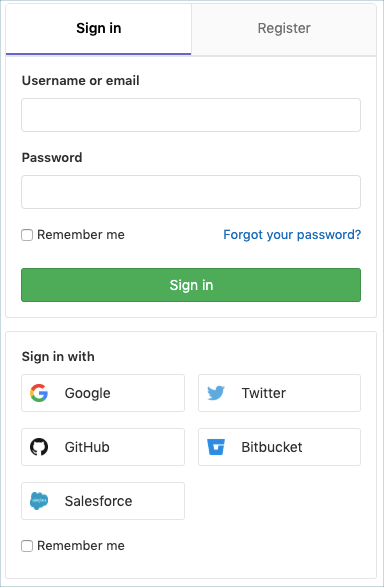
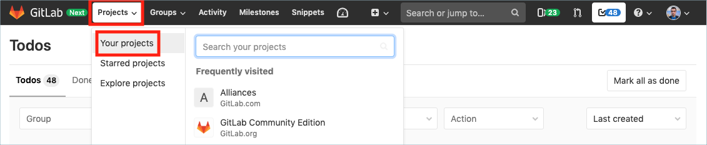
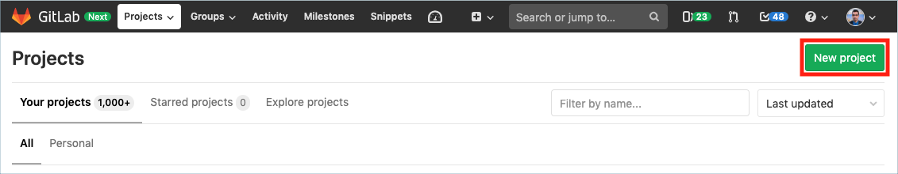
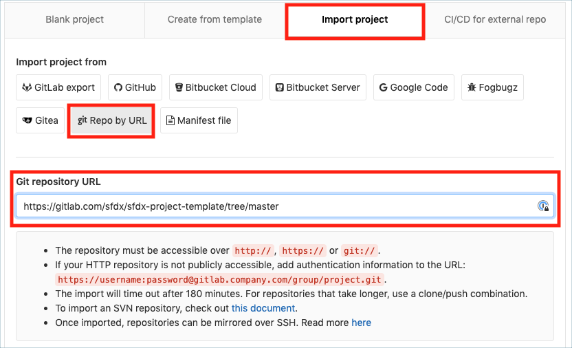
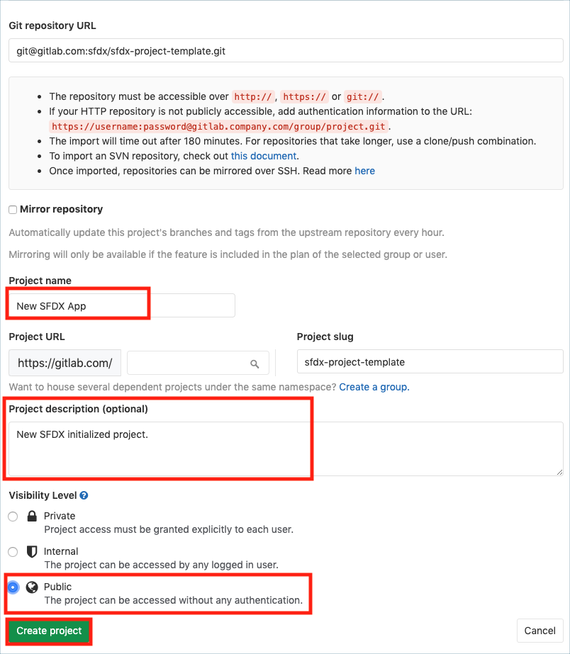
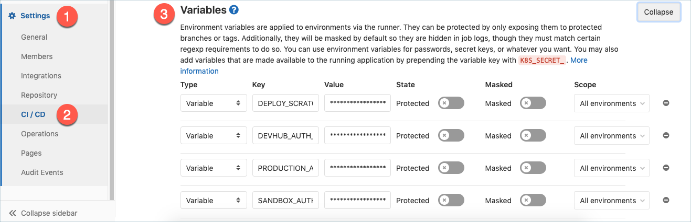
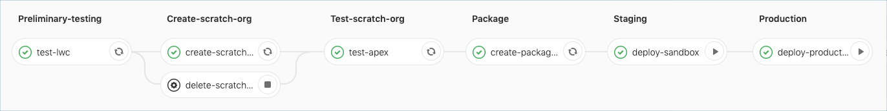

# Salesforce DX Project Template for GitLab Pipelines

This guide helps Salesforce developers get started with GitLab and Salesforce development quickly including details on development models, setting up CI/CD with GitLab pipelines, and how to deploy your final changes to production.
This project template uses the [sfdx/sfdx-cicd-template](https://gitlab.com/sfdx/sfdx-cicd-template) CI template.

# Part 1: Importing Project Templates

To use this project template for a new [GitLab Project](https://docs.gitlab.com/ee/user/project/) follow the steps below:

### Step 1

Log in to [GitLab.com](https://gitlab.com/users/sign_in). Need an account? You can [sign up](https://gitlab.com/users/sign_in) for a free GitLab account or log in with a Salesforce account.



### Step 2

Click on **Projects** and then **Your Projects** in the top navigation drop down pane.



Now click the [**New Project**](https://gitlab.com/projects/new) green button to create a new project.



### Step 3

Click **Import Project** tab at the top of the page, then click the **git Repo by URL** button.

Enter [this project's](https://gitlab.com/sfdx/sfdx-project-template) git URL: [https://gitlab.com/sfdx/sfdx-project-template.git](https://gitlab.com/sfdx/sfdx-project-template.git) in the `Git repository URL` form field.



### Step 4

Give your project a name and optionally a description to get started. Finally, after confirming your **Visibility Level** for your new project, click the **Create Project** green button to initiate.



After completing the steps above, you'll have a new project initialized under your GitLab account.

## Part 2: Choosing a Salesforce Development Model

There are two types of developer processes or models at Salesforce. These models are explained below. Each model offers pros and cons and is fully supported.
However, this project template and CI template use the Package Development Model.

### Package Development Model

The package development model allows you to create self-contained applications or libraries that are deployed to your org as a single package. These packages are typically developed against source-tracked orgs called scratch orgs. This development model is geared toward a more modern type of software development process that uses org source tracking, source control, and continuous integration and deployment.

If you are starting a new project, we recommend that you consider the package development model. For details about the model, see the [Package Development Model](https://trailhead.salesforce.com/en/content/learn/modules/sfdx_dev_model) Trailhead module.

When working with source-tracked orgs, use the commands `SFDX: Push Source to Org` (VS Code) or `sfdx force:source:push` (Salesforce CLI) and `SFDX: Pull Source from Org` (VS Code) or `sfdx force:source:pull` (Salesforce CLI). Do not use the `Retrieve` and `Deploy` commands with scratch orgs.

### Org Development Model

The org development model allows you to connect directly to a non-source-tracked org (sandbox, Developer Edition (DE) org, Trailhead Playground, or even a production org) to retrieve and deploy code directly. This model is similar to the type of development you have done in the past using tools such as Force.com IDE or MavensMate.

For details about the model, see the [Org Development Model](https://trailhead.salesforce.com/content/learn/modules/org-development-model) Trailhead module.

If you are developing against non-source-tracked orgs, use the command `SFDX: Create Project with Manifest` (VS Code) or `sfdx force:project:create --manifest` (Salesforce CLI) to create your project. If you used another command, you might want to start over with this command to create a Salesforce DX project.

When working with non-source-tracked orgs, use the commands `SFDX: Deploy Source to Org` (VS Code) or `sfdx force:source:deploy` (Salesforce CLI) and `SFDX: Retrieve Source from Org` (VS Code) or `sfdx force:source:retrieve` (Salesforce CLI). The `Push` and `Pull` commands work only on orgs with source tracking (scratch orgs).

## The `sfdx-project.json` File

The `sfdx-project.json` file contains useful configuration information for your project. See [Salesforce DX Project Configuration](https://developer.salesforce.com/docs/atlas.en-us.sfdx_dev.meta/sfdx_dev/sfdx_dev_ws_config.htm) in the _Salesforce DX Developer Guide_ for details about this file.

The most important parts of this file for getting started are the `sfdcLoginUrl` and `packageDirectories` properties.

The `sfdcLoginUrl` specifies the default login URL to use when authorizing an org. The default is https://login.salesforce.com.
If you have My Domain enabled, you can set this to your My Domain URL.

The `packageDirectories` tells VS Code and Salesforce CLI where the metadata files for your project are stored.
You need at least one package directory set in your file. The default setting is shown below.
If you set the value of a `packageDirectories` property called `path` to `force-app`, by default your metadata goes in the `force-app` directory.
If you want to change that directory to something like `src`, simply change the `path` value and make sure the directory you’re pointing to exists.

```json
"packageDirectories" : [
    {
      "path": "force-app",
      "default": true
    }
]
```

## Part 3: Input Gitlab CI/CD Pipeline Environment Variables

Before you run your CI pipeline, you need to enter a few configuration variables to allow GitLab to interact with your Salesforce orgs.

1. Install [Salesforce CLI](https://developer.salesforce.com/tools/sfdxcli) on your local machine.
2. [Authenticate using the web-based oauth flow](https://developer.salesforce.com/docs/atlas.en-us.sfdx_dev.meta/sfdx_dev/sfdx_dev_auth_web_flow.htm) to each of the orgs that represent your Dev Hub, sandbox, and production org. **Note, for initial testing of GitLab CI, your "sandbox" and "production" orgs can be Trailhead Playgrounds or any Developer Edition org.**
3. Use the `sfdx force:org:display --targetusername <username> --verbose` command to get the [Sfdx Auth Url](https://developer.salesforce.com/docs/atlas.en-us.sfdx_dev.meta/sfdx_dev/sfdx_dev_auth_view_info.htm) for your various orgs. The URL you're looking for starts with `force://`. **Note, you must use the `--verbose` argument to see the Sfdx Auth URL.**

From your GitLab project page, click **Settings**, **CI / CD**, then expand **Variables**.



Here are the Auth URL variables to set:

- `DEVHUB_AUTH_URL`
- `SANDBOX_AUTH_URL`
- `PRODUCTION_AUTH_URL` (if your prod org is the same as your Dev Hub, then this can ommitted and the DEVHUB_AUTH_URL will be used by default)

Here are some other variables that are optional:

- `DEPLOY_SCRATCH_ON_EVERY_COMMIT`: "true" to deploy a scratch org on every commit in a merge request, otherwise it won't.
- `PACKAGE_NAME`: Optional. Must match one of the `packageDirectories` entries in `sfdx-project.json`. If not present, then the CI pipeline uses the default package directory from `sfdx-project.json`.

Optionally, disable entire jobs with the following boolean variables:

- `TEST_DISABLED`
- `SCRATCH_DISABLED`
- `SANDBOX_DISABLED`
- `PRODUCTION_DISABLED`

## Part 4: Develop your App

As a quick start project, this template comes bundled with one Lightning Web Component with a Jest test, and an Apex class with a test class.
When the CI pipeline runs, it will deploy that metadata and run those tests in a new scratch org.

You're welcome to use the provided sample metadata just to test and see how the pipeline works.
When you're ready to try with your own org metadata, you may replace the contents in `force-app`.

## Part 5: Create your Package

This project template and CI template use the Package Development Model.
As a one-time step per CI pipeline, you need to create the unlocked package that the pipeline will create and install new versions for.

The `sfdx-project.json` file specifies **GitLabPipelinesPkg** as a default package name.
To use that default for testing, run the following command with Salesforce CLI:

```
sfdx force:package:create --name GitLabPipelinesPkg --packagetype Unlocked --path force-app --targetdevhubusername <DEVHUB_ALIAS>
```

The Salesforce CLI will auto-update your sfdx-project.json with the generated package id. Afterwards, your file may look something like the following:

```json
{
    "packageDirectories": [
        {
            "path": "force-app",
            "default": true,
            "package": "GitLabPipelinesPkg",
            "versionName": "Version 1.0",
            "versionNumber": "1.0.0.NEXT"
        }
    ],
    "namespace": "",
    "sfdcLoginUrl": "https://login.salesforce.com",
    "sourceApiVersion": "45.0",
    "packageAliases": {
        "GitLabPipelinesPkg": "0Ho1U0000008OVJSA2"
    }
}
```

## Part 6: Run Your Pipeline

Simply commit a change to your GitLab repository and see the GitLab CI/CD pipeline kick off!

Some CI jobs, like deploying to sandboxes or production orgs, require your commits and merge requests to occur on the `master` branch.
However, that is configurable in the gitlab-ci.yml file referenced in the CI/CD template.

